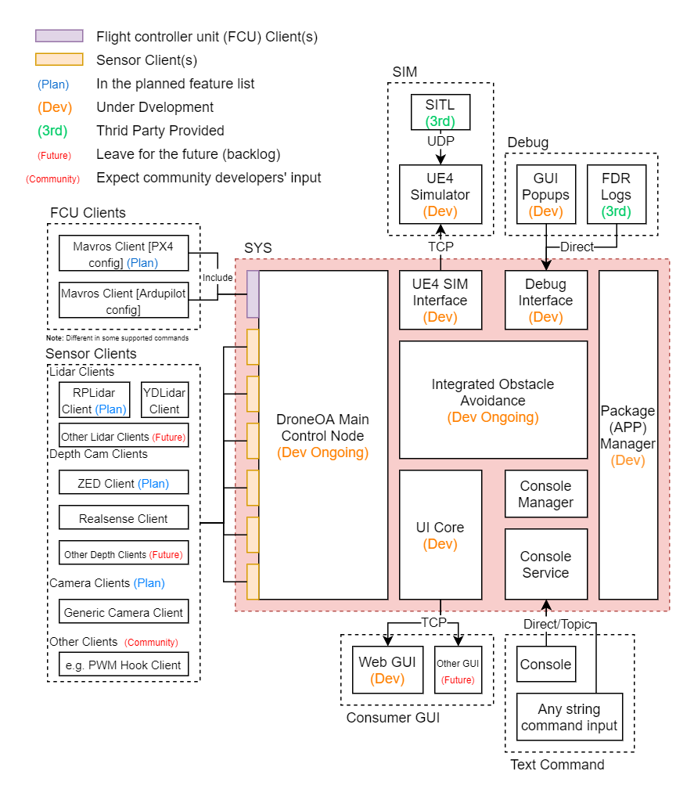

# ROS Package For Drone Obstacle Avoidance Project

## User Installation Guide & Developer Guide
[Official Wiki](http://droneoa.tuotuogzs.net/droneoa_gitbook) 

## Introduction
Drones are used in an unprecedented number of ways since the advent, with millions of people using it for agriculture, journalism, photography, courier services, etc. Seeing this opportunity, we propose to develop some solutions that make the development of drone applications easier (Including drone obstacle avoidance development) and make the drones safer at a lower altitude.

**DroneOA ROS** is a software package we have been working on to tackle this target. It provides:

- A set of unified interfaces for popular sensors and Mavlink based flight controllers
- Integrated obstacle avoidance features
- Development tool kit which consists of a UE4 based simulator, debug visualizer and debug tools
- A new simplified console command interface or a **console command "API"** for app developers
- An internal low-level control API (e.g. channel override, reset/switch communication link) for core feature developers.
- Application manager which allows installing new apps with simply a URL of its repository.
- A simplified Web-based UI API and a sample UI
- Easy to environment setup tools and prebuild and tested OS images of development/deploy environment.
- Full ROS Support and Open source

The goal of this project is to build an SDK that simplifies the development of automated drone and drone-related applications. It can also smooth the learning curve for new drone developers.

The team name **OASIS**, short for `Obstacle Avoidance with Spontaneous Itinerancy Strategies` is coming from one of our obstacle avoidance features, which allows multiple strategies (algorithm) running simultaneously. For example, both LIDAR and traditional camera with AI can be used to determine collision probabilities and/or path independently, which are then synthesized to provide a final decision.

We plan to deploy the project via drone communities, like the Ardupilot community. And potentially getting official support from the Ardupilot community. We will start to invite developers and people that are willing to learn drone development to try the system and join the development when the main control node and high priority features are finished. Community contributions and discussions are the core of this project in the long run.

### Modules And Current Progress:

### To Develop An Addon
To clearly separate apps and core features, developers have 2 strategies for integration.
Developers can choose either of the 2 strategies for integration that clearly distinguishes and separates app and core features.
- For developing an app that does not need raw sensor data or low-level control:
  - Write a separate node and only use the **console command "API"** to control the drone through ROS topic. This can avoid unexpected calls to insecure low-level functionalities.
  - So in summary, it's more like a ROS "API" which uses topic and command message as intermediary.
  - For example, a mobile ground station OR a food delivery management app falls into this category.
- For developing something which directly uses raw sensor data, and needs high control priority or low-level control (internal only commands):
  - Write the new feature direct in the main node **OR** write a receiver/mock component in the main node and communicate with an external algorithm node via a private ROS topic. 
  - Only write core features directly into the main node with access to all functionalities (including insecure ones).
  - For example, a new obstacle avoidance algorithm OR a new hardware interface falls into this category.

To make the addon/APP work with **package manager** (which is a module that manage installation, sompilation and execution of APPs and packages), please develop based on this [app-template](https://gitlab.tuotuogzs.com/droneoa/app-template)

Before starting development your first addon, we will recommend you to checkout the [Wiki](http://droneoa.tuotuogzs.net/droneoa_gitbook) and [example APPs in the shared project](https://gitlab.tuotuogzs.com/groups/droneoa/-/shared).

### Hardware

#### Test Platform:
- [OA450](https://gitlab.tuotuogzs.com/droneoa/droneoa_ros/wikis/Test-Vehicle-OA450)
- OA650 (WIP Delayed due to local policy)

#### Supported Flight Controller Unit (FCU):
- Ardupilot
- PX4
- Most Mavlink based FCU

#### Supported Sensors:
- Lidar:
    - YDLidar X2L
    - RPLidar Lineup (WIP)
- Depth Camera:
    - D435(i) local only
    - D435(I) + T265 local/global
    - ZED camera (WIP)
- Normal Camera (Planned)

#### Supported Other Equipment:
- Comunity works Coming soon.

#### Supported Onboard Computer (OBC)s:
- Jetson nano
- Raspberry Pi 4
- Up board 1st gen
- Most other x86 systems with at least 2 USB/serial ports
- More to be added

### Software Package Dependencies
#### Required ROS packages / Library:

- catkin
- nodelet
- mavros
- roscpp
- std_msgs
- sensor_msgs
- cv_bridge
- Realsense ROS
- OpenCV
- PCI library
- see `.gitlab-ci.yml` for more dependencies

### API Wiki and How to Wiki:
- Official [**How to** Wiki](http://droneoa.tuotuogzs.net/droneoa_gitbook) 
- Official [**Code API** Wiki](http://droneoa.tuotuogzs.net/droneoa-api-wiki) 

## Credit
DroneOA Group 2020 :palm_tree:
